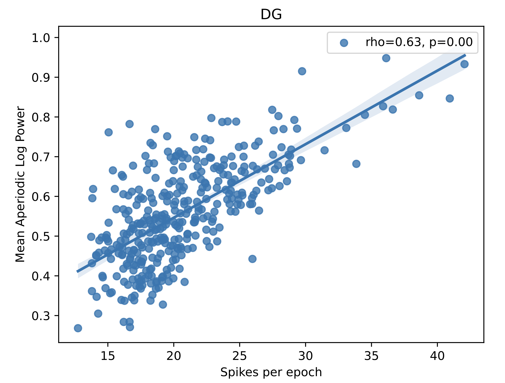
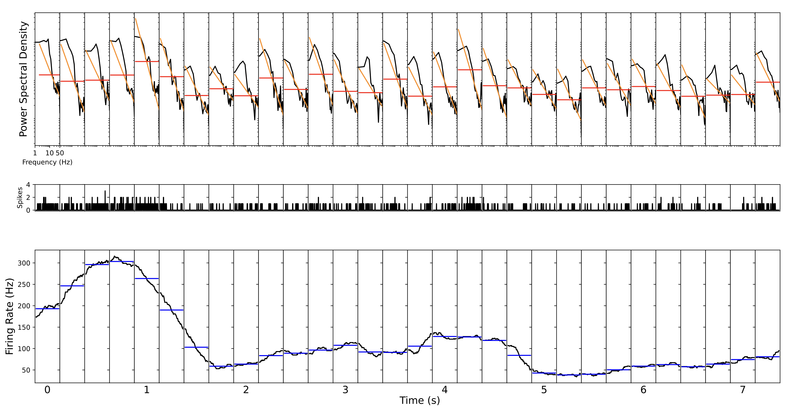
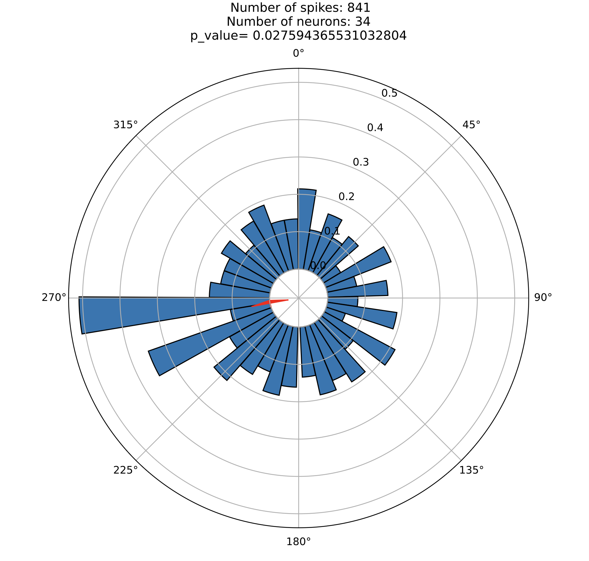

# ReTune Hackathon 2023

October 23-25, 2023 | Bad Belzig, Germany

Hackathon organized by [CRC 295 ReTune]([url](https://sfb-retune.de/en/home/)) to code on projects related to deep brain stimulation. 

My project with juliettevivien aimed at relating local field potential data to neural spiking activity, extracted from a public [neuropixel dataset]([url](https://doi.org/10.1038/s41586-019-1787-x)).

## Project organization:

- **sourcedata**: information on neuropixel dataset
- **scripts**: analysis scripts
- **notebooks**: exploratory analyses

## Results
### Local field potential aperiodic broadband power significantly correlates with neural spiking activity

### LFP aperiodic broadband power tracks spiking activity over time - successful replication of Fig. 1 in [Manning et al. (2009)]([url](https://doi.org/10.1523/JNEUROSCI.2041-09.2009))

### Spiking activity is locked to LFP phases

### References

[1] Steinmetz, N.A., Zatka-Haas, P., Carandini, M. et al. Distributed coding of choice, action and engagement across the mouse brain. Nature 576, 266–273 (2019). https://doi.org/10.1038/s41586-019-1787-x

[2] J. R. Manning, J. Jacobs, I. Fried, M. J. Kahana, Broadband shifts in local field potential power spectra are correlated with single-neuron spiking in humans. J. Neurosci. 29, 13613–13620 (2009). https://doi.org/10.1523/JNEUROSCI.2041-09.2009

